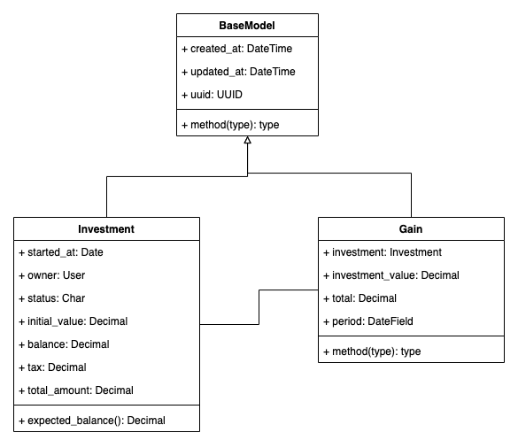

# Back End Test Project 

Esta é a resolução do teste prático de backend utilizando o framework Django.

## Como executar

- Baixe o Python, de preferência a versão 3.8 ou mais recente.
- Clonar o projeto: git clone git@github.com:gabrielloliveira/backend-test.git
- Entrar no diretório do projeto: cd backend-test
- Criar o virtualenv: python -m venv env
- Ativar o virtualenv: source env/bin/activate
- Instalar as dependências do projeto: pip install -r requirements.txt
- Rodar o setup inicial com as variáveis de ambiente: python contrib/envfile_generator.py
- Criar o banco de dados: python manage.py migrate
- Criar um usuário de teste (username e senha admin)
- Rodar o servidor: python manage.py runserveir

Ou rode através do docker:
`docker-compose up --build`

## Modelagem dos dados

Abaixo está representada a modelagem que eu escolhi para o sistema:

## Arquitetura e alguns pontos sobre o sistema

- Todos os endpoints desta aplicação estão representados no arquivo `insomnia.json`
- O mais "correto", ao meu ver, seria criar uma entidade de movimentações, onde poderíamos representar a compra de 
novas ações e o pagamento de dividendos das mesmas. Operações de entrada e saída na conta do usuário. Entretanto, 
não implementei isso por entender que o projeto ira servir somente para "demonstrar" as minhas habilidades.
- Outra malehoria que poderia ser feita neste projeto, seria criar uma task, utilizando celery, por exemplo, onde, 
uma vez por dia, ele iria verificar os investimentos que irão receber dividendos. A partir daí criaria uma movimentação 
do tipo de entrada na carteiro do cliente.  
- Este projeto contém integração com Github Actions, testes automatizados e api swagger. 

## Tecnologias que esse projeto utiliza

- Github Actions
- Pytest
- Django REST Framework
- drf-yasg (documentação automática no django)
- python-decouple
- Autenticação por jwt
- Suporte a banco de dados postgres e sqlite3
- Docker
- Heroku

Link para o projeto no ar: https://coderockr.herokuapp.com/
